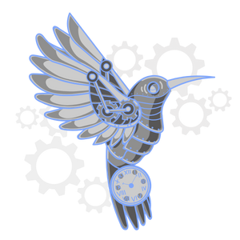

## Hello World

This image was created by [Aisha Rincon](https://github.com/AishaRincon) using [Canva](https://www.canva.com/).

Resources | What I Learned From Them
:-------: | :----------------------:
[React JS Form Validation / Axios User Registration Form Submit / Beginners to Intermediate](https://www.youtube.com/watch?v=brcHK3P6ChQ&ab_channel=DaveGray) and [React User Login and Authentication with Axios](https://www.youtube.com/watch?v=X3qyxo_UTR4&ab_channel=DaveGray) | I learned how to create a sign up and log in form with accessibility in mind.
[How To Create Advanced CSS Dropdown Menus](https://www.youtube.com/watch?v=S-VeYcOCFZw&ab_channel=WebDevSimplified) | I learned how to create a dropdown menu using the ```matches``` and ```closest``` methods.
[CSS Toggle Switch / On Off Button Design Using HTML And CSS / 4 Minutes Tutorial](https://www.youtube.com/watch?v=uCjDIMADK0w&ab_channel=EasyTutorials) | I learned how to create a toggle using a label, a checkbox input, and a span.
[Infinite Scrolling With React - Tutorial](https://www.youtube.com/watch?v=NZKUirTtxcg&ab_channel=WebDevSimplified) | I learned how to create infinite scrolling using the intersection observer API.
[Move Cursor to the Beginning or END of Input field in JS](https://bobbyhadz.com/blog/javascript-move-cursor-end-of-text-input) | When you set a default value for your input or textarea and focus on it, the cursor appears in front of the text. I learned that the ```useSelectionRange``` method can move the cursor behind the text by passing it a selection start and end that's one index greater than the text's length.
[How to (really) remove eventListeners in React](https://dev.to/marcostreng/how-to-really-remove-eventlisteners-in-react-3och) | ```removeEventListener``` must be passed an event and a named function that match the ```addEventListener``` you want to remove. When React rerenders the page due to state changes, functions don't match previous renders of themselves. I learned that the ```useCallback``` hook can prevent functions from rerendering by passing it an empty dependency array.

## Front-End Dependencies
* [create-react-app](https://www.npmjs.com/package/create-react-app)
* [react-icons](https://www.npmjs.com/package/react-icons)
* [react-router-dom](https://www.npmjs.com/package/react-router-dom)

## Back-End Dependencies
* [bcrypt](https://www.npmjs.com/package/bcrypt)
* [cors](https://www.npmjs.com/package/cors)
* [cookie-session](https://www.npmjs.com/package/cookie-session)
* [dotenv](https://www.npmjs.com/package/dotenv)
* [express](https://www.npmjs.com/package/express)
* [mongoose](https://www.npmjs.com/package/mongoose)

## Deployment Tools
* [Vercel](https://vercel.com/)